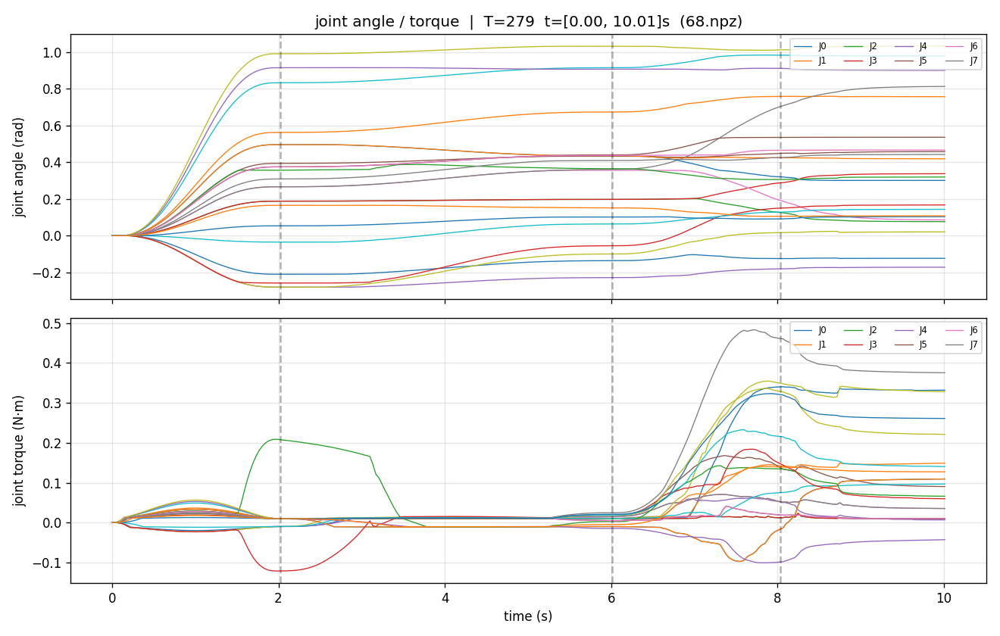
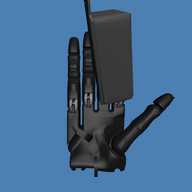

# SoftGrasp MuJoCo 复现仓库

基于 DexGraspBench 与 BODex 数据集，在 MuJoCo 中复现 SoftGrasp: 基于多模态模仿学习的灵巧手自适应抓取方法 的**仿真数据采集**。

## 项目结构

```bash
~/my_project/
├── data
│   └── index.json                # 数据清单
├── DexGraspBench/                # 本仓库
└── bodex_data/                   # 数据源（需自行下载）
    ├── DGN_2k/                   # 物体资产
    │   ├── processed_data/
    │   ├── scene_cfg/
    │   └── valid_split/
    └── bodex_shadow/
        └── succ_collect/
            └── <物体名>/floating/scale0XX.npy
```

## 首次配置
```bash
# 1. 软链物体资产到仓库
cd ~/my_project/DexGraspBench
mkdir -p assets/object
ln -sfn ~/my_project/bodex_data/DGN_2k assets/object/DGN_2k

# 2. 转换抓取数据（一次性，约 10-30 分钟）
python src/main.py task=format exp_name=debug \
    task.data_name=Learning \
    task.data_path=/xxx/xxx/my_project/bodex_data/bodex_shadow/succ_collect \
    n_worker=16

# 3. 建采集目录 + 软链数据源
cd output
mkdir -p collect_data_shadow
ln -sfn ../debug_shadow/graspdata collect_data_shadow/graspdata
cd ..
```

## 具体使用

渲染画面但不采集数据
```bash
python src/main.py task=eval exp_name=collect_data \
    setting=collect \
    task.debug_viewer=True \
    task.max_num=1
```

不开启渲染、纯采集数据
```bash
python src/main.py task=eval exp_name=collect_data \
    setting=collect \
    task.debug_render=True \
    task.collect_data=True \
    task.max_num=100
```

---

## 完整流程

### 建实验目录 + 软链
```bash
EXP=collect_data
mkdir -p output/${EXP}_shadow

ln -sfn /xxx/xxx/my_project/DexGraspBench/output/debug_shadow/graspdata \
        /xxx/xxx/my_project/DexGraspBench/output/${EXP}_shadow/graspdata

find -L output/${EXP}_shadow/graspdata -name "*.npy" | wc -l
```

### 后台采集
```bash
cd ~/my_project/DexGraspBench
mkdir -p logs

nohup python src/main.py task=eval exp_name=collect_data \
    setting=collect \
    task.debug_render=True \
    task.collect_data=True \
    task.max_num=1339 \
    skip=False \
    > logs/collect_data.log 2>&1 &

echo "采集 PID: $!"
echo "监控: tail -f logs/collect_data.log"
```

### 监控（另开终端）
```bash
# 实时日志
tail -f ~/my_project/DexGraspBench/logs/collect_data.log

# 已采条数
watch -n 30 'find ~/my_project/DexGraspBench/output/collect_data_shadow/dataset -name "*.npz" 2>/dev/null | wc -l'

# 磁盘占用
watch -n 60 'du -sh ~/my_project/DexGraspBench/output/collect_data_shadow/dataset 2>/dev/null'
```

### 后台评测(采集完成后)
```bash
cd ~/my_project/DexGraspBench

nohup python src/main.py task=eval exp_name=collect_data \
    setting=fc \
    task.max_num=1339 \
    > logs/eval_data.log 2>&1 &

echo "评测 PID: $!"
echo "监控: tail -f logs/eval_data.log"
```

### 验证
```bash
cd ~/my_project/DexGraspBench

echo "=== dataset ==="
find output/collect_data_shadow/dataset -name "*.npz" | wc -l

echo "=== evaluation ==="
find output/collect_data_shadow/evaluation -name "*.npy" | wc -l

echo "=== succgrasp ==="
find output/collect_data_shadow/succgrasp -name "*.npy" | wc -l

echo "=== 体积 ==="
du -sh output/collect_data_shadow/dataset

echo "=== 磁盘剩余 ==="
df -h /home | tail -1
```

### 生成 index.json
```bash
conda activate dgbench
cd ~/my_project/DexGraspBench

python scripts/build_index.py \
    --exp collect_data \
    --success-only \
    --out ~/my_project/data/index_data.json
```

---


## 脚本使用简介

本仓库在 DexGraspBench 基础上扩展了多模态数据可视化脚本。
画关节角度 / 扭矩曲线
```bash
python scripts/plot_collect_curves.py --exp collect_data
```

导出相机图像
```bash
python scripts/export_wrist_cam.py --exp collect_data
```

## 数据可视化图像

**关节角度 / 扭矩曲线**（10 秒完整抓取过程）：



**手腕相机视角**（抓取全过程）：


        
## References

- **SoftGrasp paper**  
  Li Y, Guo C, Ren J, Chen B, Cheng C, Zhang H, Lu H.  
  *SoftGrasp: Adaptive Grasping Method for Dexterous Hand Based on Multimodal Imitation Learning.*  
  Biomimetic Intelligence and Robotics, 2025, 100217.  
  DOI: [10.1016/j.birob.2025.100217](https://doi.org/10.1016/j.birob.2025.100217)

- **SoftGrasp code**  
  https://github.com/nubot-nudt/SoftGrasp

- **BODex dataset / code**  
  Chen J, et al.  
  *BODex: Scalable and Efficient Robotic Dexterous Grasp Synthesis Using Bilevel Optimization.*  
  arXiv:2412.16441.  
  GitHub: [https://github.com/JYChen18/BODex](https://github.com/JYChen18/BODex)  
  Project page: [https://bodex-grasp.github.io/](https://bodex-grasp.github.io/)

- **DexGraspBench**  
  GitHub: [https://github.com/JYChen18/DexGraspBench](https://github.com/JYChen18/DexGraspBench)

- **BODex assets / DGN_2k processed data**  
  见 BODex 仓库说明与 `DGN_2k_processed.zip` 下载页。